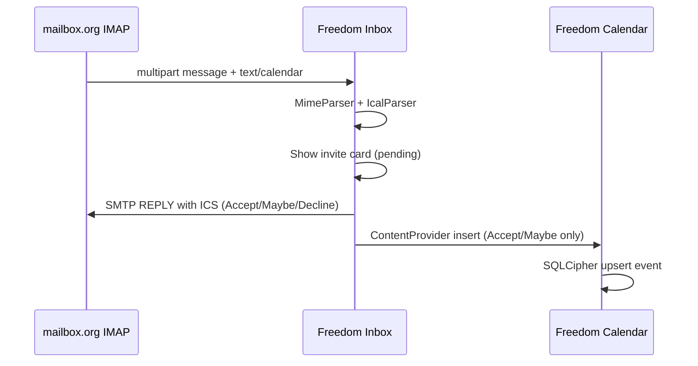

# Freedom Calendar Protocol (FCP)

Local-first encrypted calendar. No CalDAV. No mailbox.org calendar sync.

## Design

| Layer | What |
|-------|------|
| **Storage** | SQLCipher Room (`freedom_calendar.db`) — events never leave device in plaintext |
| **Sync** | Freedom Sync namespace `calendar` → encrypted `calendar.bin` blob |
| **Email invites** | Freedom Inbox parses `text/calendar` MIME parts, user Accept / Maybe / Decline |
| **Cross-app bridge** | Signature-protected `ContentProvider` (`org.freedomsuite.calendar.events`) |

## Why dump CalDAV?

CalDAV sends iCalendar in plaintext to the provider. Freedom Suite treats the calendar as **private device data**. Mail still uses IMAP/SMTP (user-chosen server), but calendar events are:

1. Stored encrypted locally
2. Backed up via Freedom Sync (E2EE blob)
3. Populated from email invites the user explicitly accepts

## Email → calendar flow



## RSVP responses

| User action | SMTP | Calendar |
|-------------|------|----------|
| Accept | `METHOD:REPLY`, `PARTSTAT=ACCEPTED` | Event added |
| Maybe | `METHOD:REPLY`, `PARTSTAT=TENTATIVE` | Event added (tentative) |
| Decline | `METHOD:REPLY`, `PARTSTAT=DECLINED` | Not added |

## Freedom Sync snapshot (v1)

```json
{
  "version": 1,
  "calendars": [{ "id": "local:personal", "displayName": "Personal" }],
  "events": [{
    "uid": "...",
    "title": "...",
    "startEpochMs": 0,
    "endEpochMs": 0,
    "source": "EMAIL",
    "responseStatus": "ACCEPTED",
    "sourceMailUid": 42,
    "rawInviteIcs": "..."
  }]
}
```

## Modules

| Module | Role |
|--------|------|
| `protocol/ical` | Parse/build ICS, RSVP replies |
| `protocol/mime` | Extract calendar parts from email |
| `core/calendar-api` | ContentProvider contract |
| `protocol/caldav` | **Deprecated for calendar app** — kept for integration tests only |

## Permissions

Both Inbox and Calendar must be signed with the same release key. The bridge permission `org.freedomsuite.permission.CALENDAR_BRIDGE` is `signature` level.
