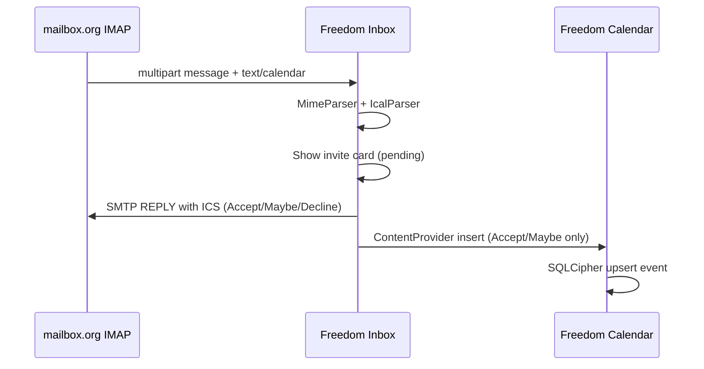

# Freedom Calendar Protocol (FCP)

Local-first encrypted calendar. No CalDAV. No mailbox.org calendar sync.

## Design

| Layer | What |
|-------|------|
| **Storage** | SQLCipher Room (`freedom_calendar.db`) — events never leave device in plaintext |
| **Sync** | Freedom Sync namespace `calendar` → encrypted `calendar.bin` blob |
| **Email invites** | Freedom Inbox parses `text/calendar` MIME parts, user Accept / Maybe / Decline |
| **Cross-app bridge** | Signature-protected `ContentProvider` (`org.freedomsuite.calendar.events`) |

## Why dump CalDAV?

CalDAV sends iCalendar in plaintext to the provider. Freedom Suite treats the calendar as **private device data**. Mail still uses IMAP/SMTP (user-chosen server), but calendar events are:

1. Stored encrypted locally
2. Backed up via Freedom Sync (E2EE blob)
3. Populated from email invites the user explicitly accepts

## Email → calendar flow



## RSVP responses

| User action | SMTP | Calendar |
|-------------|------|----------|
| Accept | `METHOD:REPLY`, `PARTSTAT=ACCEPTED` | Event added |
| Maybe | `METHOD:REPLY`, `PARTSTAT=TENTATIVE` | Event added (tentative) |
| Decline | `METHOD:REPLY`, `PARTSTAT=DECLINED` | Not added |

## Agenda UI

Events are grouped by day in the list screen:

| Header | When |
|--------|------|
| **Today** | Start falls on the current local day |
| **Tomorrow** | Start falls on the next local day |
| Full date | All other upcoming/past days |

**Upcoming** shows events whose end is still in the future; **Past** shows ended events. All-day events display as `All day · <date>`.

## Local reminders

Reminders are **on-device only** — no push server, no CalDAV alarms.

| Piece | Role |
|-------|------|
| `EventReminderScheduler` | `AlarmManager.setExactAndAllowWhileIdle` per event |
| `EventReminderReceiver` | Fires notification via `EventNotifier` |
| `ReminderBootReceiver` | Re-schedules alarms after reboot |
| `CalendarApplication` | Re-schedules on cold start |

**Permissions:** `POST_NOTIFICATIONS` (Android 13+), `SCHEDULE_EXACT_ALARM`, `RECEIVE_BOOT_COMPLETED`.

**Defaults:** New local events default to **15 minutes before**. Email invites accepted from Inbox get the same default unless changed on edit.

**Choices:** None, at event time, 5 / 15 / 30 min, 1 hour, 1 day before.

Tapping a reminder notification opens the event detail screen.

## Freedom Sync snapshot (v2)

```json
{
  "version": 2,
  "calendars": [{ "id": "local:personal", "displayName": "Personal" }],
  "events": [{
    "uid": "...",
    "title": "...",
    "startEpochMs": 0,
    "endEpochMs": 0,
    "isAllDay": false,
    "reminderMinutesBefore": 15,
    "source": "EMAIL",
    "responseStatus": "ACCEPTED",
    "sourceMailUid": 42,
    "rawInviteIcs": "..."
  }]
}
```

## Modules

| Module | Role |
|--------|------|
| `protocol/ical` | Parse/build ICS, RSVP replies |
| `protocol/mime` | Extract calendar parts from email |
| `core/calendar-api` | ContentProvider contract |
| `protocol/caldav` | **Deprecated for calendar app** — kept for integration tests only |

## Permissions

Both Inbox and Calendar must be signed with the same release key. The bridge permission `org.freedomsuite.permission.CALENDAR_BRIDGE` is `signature` level.
