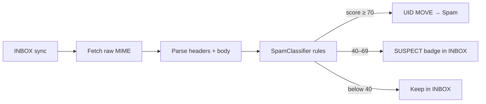

# Inbox spam filter

Freedom Inbox runs an **on-device rule engine** on every synced message. High-confidence spam is **moved to the server Spam/Junk folder** during INBOX sync (replacing weak provider filtering). Scores and reasons are stored locally for transparency.

All classification happens on your phone — no message content is sent to third-party spam services.

## Approach



1. **Sync** — up to 50 messages per folder refresh.
2. **Parse** — full headers (To, Cc, Delivered-To, Authentication-Results, List-Id, etc.) and plain body.
3. **Score** — weighted rules summed to 0–100+.
4. **Act** — `SPAM` (≥70) → IMAP move to Spam/Junk; `SUSPECT` (40–69) → stays in INBOX with badge; `HAM` → normal.

User actions: swipe **Spam** (left) to report; in Spam folder swipe **Not spam** (right) to move back to INBOX.

## Owned addresses (false-positive guard)

Spam rules must not assume a single login address. You may have **aliases** and **multiple domains**.

**Owned** = any of:

| Source | Example |
|--------|---------|
| Primary account email | `me@mailbox.org` |
| Saved aliases | `shop@mybrand.com`, `contact@other.org` |
| Owned domains | `mybrand.com`, `other.org` → any `*@mybrand.com` counts |

Configured in secure account prefs (`AccountStore`: `aliases`, `owned_domains`). Primary domain is added automatically on setup.

**Recipient check** — mail is considered addressed to you if **any** of these headers contains an owned address:

- `To`, `Cc`, `Delivered-To`, `X-Original-To`, `Envelope-To`, `X-Envelope-To`

**Mailing lists** — if `List-Id` is present or `Precedence: list|bulk|junk`, the “missing recipient” rule is **skipped** (newsletters legitimately use list addresses in To).

**BCC** — mail delivered only via BCC often has your address in `Delivered-To` only; that header is checked.

## Rules and weights

| Rule ID | Weight | Trigger |
|---------|--------|---------|
| `missing_recipient` | +40 | Not to any owned address (unless mailing list) |
| `auth_failure` | +35 each | SPF/DKIM/DMARC fail in `Authentication-Results` |
| `provider_spam_header` | +50 | `X-Spam-Flag: YES`, `X-Spam-Status` yes, or `X-Spam-Score` ≥ 5 |
| `display_name_spoof` | +25 | Display name mentions PayPal/Amazon/bank etc., domain mismatch |
| `from_reply_mismatch` | +20 | `Reply-To` domain ≠ `From` domain |
| `return_path_mismatch` | +15 | `Return-Path` domain ≠ `From` domain |
| `suspicious_subject` | +15 | Known spam phrases, ALL CAPS, excessive `!` |
| `suspicious_tld` | +15 | Body links to `.xyz`, `.top`, `.click`, etc. |
| `url_heavy` | +10 | More than 5 `http(s)` links in body |
| `suspicious_from` | +10 | Unparseable From |
| `empty_subject` | +5 | Blank or “(no subject)” |
| `mailing_list` | −20 | List-Id / list precedence (reduces score) |
| `calendar_invite` | −30 | Calendar ICS part present |

**Verdicts**

| Score | Verdict | Behaviour |
|-------|---------|-----------|
| ≥ 70 | `SPAM` | Auto-move to Spam/Junk on sync |
| 40–69 | `SUSPECT` | Stays in INBOX, “Suspect” label |
| &lt; 40 | `HAM` | Normal |

Thresholds are defined in `SpamClassifier` (`suspectThreshold=40`, `spamThreshold=70`).

## IMAP folders

The client resolves Spam/Junk folder names from server LIST (`Spam`, `Junk`, `[Gmail]/Spam`, etc.). Moves use `UID MOVE`.

## Storage

`MailMessageEntity` fields: `spamScore`, `spamVerdict`, `spamReasons` (semicolon-separated `rule:weight` list). DB version 4+.

## Code layout

| Path | Role |
|------|------|
| `apps/inbox/.../spam/SpamClassifier.kt` | Rule engine |
| `apps/inbox/.../spam/OwnedAddresses.kt` | Alias / multi-domain matching |
| `apps/inbox/.../data/InboxRepository.kt` | Classify on sync, auto-quarantine |
| `protocol/mime/MimeParser.kt` | Header extraction |
| `protocol/imap/ImapConnection.kt` | `moveToSpam`, `moveToInbox` |

## Tests

```bash
./gradlew :apps:inbox:testDevDebugUnitTest --tests "org.freedomsuite.inbox.spam.*"
```

## Future work

- Settings UI to edit aliases and owned domains
- User “block sender” / allowlist feedback loop
- Optional on-device ML layer on top of rules (privacy-preserving)
- Persist user spam/not-spam actions to tune weights locally

## Related

- [MAIL-DISCOVERY.md](MAIL-DISCOVERY.md) — account setup
- [DEV-MAIL-SERVER.md](DEV-MAIL-SERVER.md) — local testing (mock server includes Spam folder)
